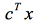
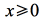
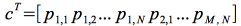
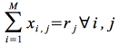
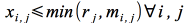
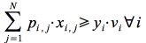
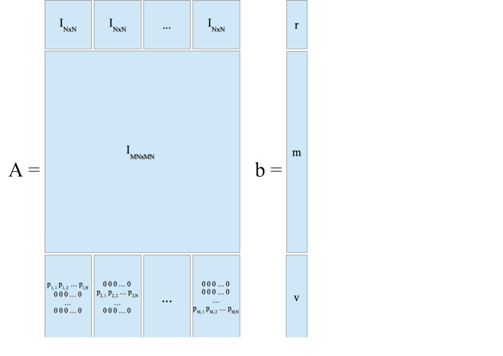

#bricklink-helper

This is how LEGO projects grind to a halt if you order your bricks by hand...

##Introduction

The idea came when I tried to build one of [Chris McVeigh's beautiful Lego designs](http://chrismcveigh.com/cm/building_guides_-_technology.html). I was already a regular user of [BrickLink](http://www.bricklink.com/) but never faced the problem of a) finding less common Lego parts and/or b) doing that often, when it becomes a substantial volume of work. I thought that it would have been useful to automate as much as possible of the process taking me from the building instructions to the actual orders, spending as little time and money in the process.

##The data
BrickLink offers APIs for its sellers, but not for its customers. I needed a way to easily search for Lego parts programmaticaly. That was the first problem I addressed. By scraping BrickLink's search results web pages I got a reliable source of part availability data. This is already working nicely at the time of writing, although a bit more testing wouldn't hurt.

##The algorithms
How you get from the availability data to the actual orders depend on how exactly you define your objectives. 

For early testing, I started from possibly the simplest approach to the problem, that was 'greedily' buying bricks starting from the seller that can offer the largest order and continuing that way until all possible pieces are found. This is already implemented in [bricklink-order-greedy.js](bricklink-order-greedy.js).

The second approach, potentially optimal, is looking at the problem as a pure [integer linear programming](http://en.wikipedia.org/wiki/Integer_programming) one and tackling it using algorithms in literature, starting from the obvious ["simplex"](http://en.wikipedia.org/wiki/Simplex_algorithm). This work is ongoing.

##The maths

Read [Wikipedia's description of the simplex algorithm](http://en.wikipedia.org/wiki/Simplex_algorithm) first. The first objective is describing the problem in its standard components, but I need to take a few assumptions first: 

- **I will rely on UK sellers only**, shipping to UK buyers (myself).

- **I will not be considering parts that are unavailable in their full quantity from at least one of the above BrickLink sellers**. Those are particularly rare and will be procured through the more expensive [LEGO “Pick a brick” service](http://shop.lego.com/en-GB/Pick-A-Brick-ByTheme). This constraint will ensure that the problem has at least one solution, that is the obvious one of ordering all pieces of each part by the respective seller who offers all of them.

- **I will not be considering the real shipping costs**, as it is practically impossible to get them in machine-readable format from BrickLink. In their place, I will associate to each order a "virtual", fixed  cost _S_ (as in "shipping") that is always the same, whatever the seller. That will also represent the cost intrinsic into managing an order (making the order, managing the incoming post, checking that the pieces correspond to the order...) and will assure that the algorithm won't excessively fragment the overall order across too many sellers. Moreover, as we are dealing with sellers that are all based in the same country, we can presume that the shipping costs are similar for each order. 

- The same seller can offer the same part at different prices, e.g. because some bricks can be used and others new. For simplicity, **I will be considering the sellers' worst price only**. 

Given the above, the problem looks like this:

- minimise 
  
  

- subject to 

  

  

- and

  

In more detail:

Where:
- *N* is the number of different parts that I need and are available on the BrickLink market.
- *M* is the number of UK sellers, shipping to UK customers, who offer the full quantity of at least one of the above parts, plus any quantity of any other part.
- *xi,j* is the number of bricks of the *j-th* part that I order from the *i-th* seller
- *T* is the total number of pieces I can buy, that is the sum of all *xi,j*'s (it will be used further down in the document).
- *yi* are boolean variables that represent if I order (1) or not (0) from the *i-th* seller. Introducing M boolean variables may look overkill, but you will find out as you keep reading that these variables also cover another important role in our problem.
- *pi,j* is the *i-th* seller's worst price for the *j-th* part. 

*A* is the expression of several kind of constraints. 

- First, I need to satisfy my requirements
  
  

  where *rj is the number of required bricks for the *j-th* part ("r" as in requirement).

- Second, I can't order from a supplier more pieces than they got:
  
  
  
  where *mi,j* is the *i-th* seller's availability of the *j-th* part ("m" as in max number of bricks) .

- Third, the *i-th* seller has the faculty not to accept orders whose value is smaller than *vi*. Note that this is a **conditional constraint**, and adds a whole new layer of complication to the maths of the problem.
  
  

  [AIMMS](http://business.aimms.com/) kindly offers for download the "Integer Programming Tricks" chapter from their "Modelling Guide" book. [Section 7.4](http://www.aimms.com/aimms/download/manuals/aimms3om_integerprogrammingtricks.pdf) describes how to transform conditional constraints into normal constraints. We will take advantage of the *y* variables defined earlier and add two constraints for each seller: 

  - first, we actually give mathematical meaning to *yi*:

    

    For simplicity, in the following I won't show the constraints that make the *y*'s binary, in the same way I am not showing that the *x*'s are >= 0.

  - then, we transform the original conditional constraint into the following:

    

    You can see that:
    - when I am buying from the *i-th* seller, *yi* is 1 and the new constraint form assures the minimum buy;
    - when I am *not* buying from the seller, *yi* is 0 and the new constraint form removes the minimum buy constraint. 

The whole set of constraints translates in an *A* that looks like in the diagram below. Click on the picture to see an SVG of the same at full resolution.

##The tools

My favourite programming environment for developing contraptions like this is [NodeJS](http://nodejs.org/): versatile, lightweight, efficient, re-usable, rich of libraries... but all programming environments have their weaknesses and limitations. In this case, NodeJS was fantastic for the scraping part, but does not natively support memory-efficient matrices: even trying to create an **empty** *A* put it on its knees. The problem is not even the memory required to store *A*, but just its dimensions.

I could have put custom, more memory-efficient matrix manipulation libraries to the test, and I gave [Math.js](http://mathjs.org/) a shot, but had the same identical problem. The most natural thing to do was then to integrate the NodeJS code I had already written with my favourite programming environment for data science: R.

CRAN's ["task view" on optimisation and mathematical programming](http://cran.r-project.org/web/views/Optimization.html) lists many options. The most obvious choice was [Rsymphony](http://cran.r-project.org/web/packages/Rsymphony/Rsymphony.pdf): R's wrapper around the open source ["SYMPHONY" library](http://www.coin-or.org/projects/SYMPHONY.xml).

##Licence

 This work is licensed under a [Creative Commons Attribution 4.0 International](http://creativecommons.org/licenses/by/4.0/).

LEGO(R) is a trademark of the LEGO Group of companies which does not sponsor, authorize, or endorse this project.  

Running this code is equivalent to anonymously browsing the [BrickLink website](http://www.bricklink.com/). Using the BrickLink website constitutes acceptance of their [terms of service agreement](http://www.bricklink.com/help.asp?helpID=1919) and [privacy policy](http://www.bricklink.com/help.asp?helpID=47). In particular, be aware that you are not allowed to use this software to distribute, disclose, upload, or transfer to any third party any content or data you receive from or which is displayed on BrickLink.

A single execution of the script will generate hundreds of pages being read on the BrickLink website: don't do that lightheartedly, cache the results wherever possible and be respectful of the BrickLink team's work.