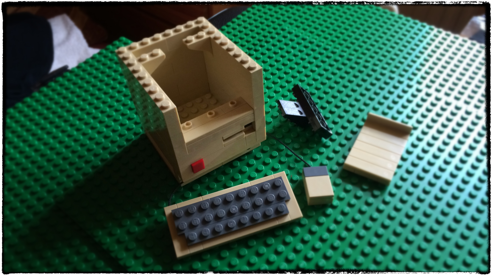
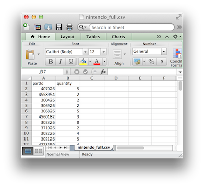
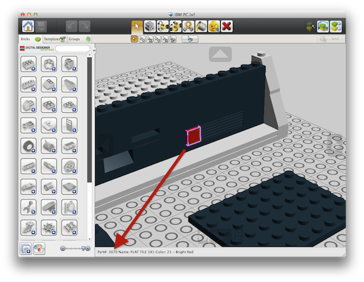
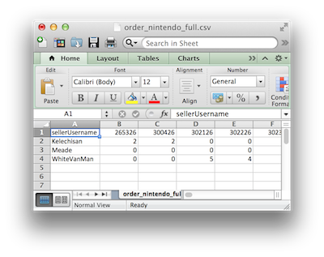

#bricklink-helper

This is how LEGO projects grind to a halt if you order your bricks by hand...

## Table of contents

- [Introduction](#introduction)
- [Usage](#usage)
- [The data](#the-data)
- [The algorithm](#the-algorithm)
- [The maths](https://github.com/Digital-Contraptions-Imaginarium/bricklink-helper/blob/master/docs/the_maths_and_the_tools.md#the-maths)
- [The tools](https://github.com/Digital-Contraptions-Imaginarium/bricklink-helper/blob/master/docs/the_maths_and_the_tools.md#the-tools)
- [Licence](#licence)

##Introduction

[BrickLink](http://www.bricklink.com/) is an independent marketplace for new and used LEGO parts. It is an invaluable resource for LEGO lovers around the world, allowing them to buy the most disparate parts at very affordable prices. 

When you have very specific needs, though, like buying all the bricks you need to build one of [Chris McVeigh's beautiful LEGO designs](http://chrismcveigh.com/cm/building_guides_-_technology.html), BrickLink's search features won't be able to help you much . [The Nintendo "NES" model](http://www.powerpig.ca/lego_kit_guides_2014/my_first_console_sprite.pdf), for example, is made of 61 different parts and a total of 217 pieces. This means that you will have to search BrickLink for each of those 61 parts, struggling to find the same seller offering more than one. If you're lucky, and after a couple of hours of diligent work, you will end up making perhaps a dozen orders, very likely spending more than necessary in both pieces and shipping costs.

Enter bricklink-helper! Bricklink-helper (or "BH" for short) will search BrickLink for you and calculate the most cost effective set of orders for you to make, all of this by running a script for a few minutes. As simple as that. 

Running BH vs the Nintendo NES parts list on the evening of 15/5/2014 managed to procure all but 7 of the 217 pieces by relying on **3** sellers only and spending an average of 9p per piece, including shipping.

##Usage

BH requires runtime environments for both NodeJS and R.

You will be able to install all required NodeJS libraries by just running:

    npm install

With R it may be a bit more complicated. Try executing:

    rscript bricklink-order-simplex.R

and if everything goes according to plan your R runtime will automatically install the binaries for the necessary packages.

If all is working nicely, launch BH by doing:

    node bricklink-helper.js --in parts_list_1 [--in parts_list_2] --out orders.csv [--cache cache.json]

The *parts_list* files can either be 'lxf' files, produced using LEGO's free [Digital Designer software](http://ldd.lego.com/en-gb/), or more simple CSV files: practically spreadsheets with two columns: the LEGO part id (named "partId") and the required quantity ("quantity"). 

You can specify as many input parts lists as you like: this is useful in case you wanted to build mode models, or more copies of the same; moreover, the more pieces you buy the more likely economies of scale are possible. 

If you don't know the LEGO part id for a brick, you can use LEGO's Digital Designer: drag any piece in the window as if you wanted to use it for your model, and you will see the part id in the bottom status bar.

The output will be a simple CSV file with one row for each selected seller and one column per part Id.

It can happen that for particularly rare pieces the script won't be able to find options on BrickLink and it will tell you. In that case, you still have the option to use the more expensive [“Pick a brick” service](http://shop.lego.com/en-GB/Pick-A-Brick-ByTheme) by LEGO themselves.

    *** WARNING *** Suitable sellers could not be found for part ids: part_id_1, part_id_2...

What to do then is obvious: for each seller, go to *http://www.bricklink.com/store.asp?p=seller_username* and make your order!

The use of the *cache* parameter is very important. It will save the results of the search locally in a JSON file, so that if you decide to order fewer pieces BH won't need to search BrickLink again for practically the same pieces and quantities. A typical execution of BH generates hundreds of requests to the BrickLink website: don't do that lightheartedly and cache the results wherever possible and be respectful of the BrickLink team's work and the money that goes into running it.

The entire execution can take a long time. E.g. the last time I tested running BH vs the Nintendo NES model on a 2.6Ghz MacBook Pro with 16Gb RAM, calculating the optimal set of orders took about 20 minutes after searching on BrickLink completed.  

##The data

BrickLink offers APIs for its sellers, but not for its customers. I needed a way to easily search for LEGO parts programmaticaly. Scraping BrickLink's search results web pages gave me a reliable source of part availability data. 

##The algorithm

How you get from the pieces availability data to the actual orders depend on how exactly you define your objectives. 

For early testing, I originally implemented the simplest approach possible, that was 'greedily' buying bricks starting from the seller that could offer the largest order, and then continuing like tha until all possible pieces were found.

The second and current approach looks at the problem as a pure [integer linear programming](http://en.wikipedia.org/wiki/Integer_programming) mathematical problem, and tackles it using algorithms in literature, starting from the obvious ["simplex"](http://en.wikipedia.org/wiki/Simplex_algorithm). Many implementations are available as open source, read more about the current implementation [here](docs/the_maths_and_the_tools).

If you're not happy with the above, well, develop your own algorithm! :-) Many things could be done differently, several are already captured in [the project's issues page](https://github.com/Digital-Contraptions-Imaginarium/bricklink-helper/issues?state=open).

##Licence

 This work is licensed under a [Creative Commons Attribution 4.0 International](http://creativecommons.org/licenses/by/4.0/).

LEGO(R) is a trademark of the LEGO Group of companies which does not sponsor, authorize, or endorse this project.  

Running this code is equivalent to anonymously browsing the [BrickLink website](http://www.bricklink.com/). Using the BrickLink website constitutes acceptance of their [terms of service agreement](http://www.bricklink.com/help.asp?helpID=1919) and [privacy policy](http://www.bricklink.com/help.asp?helpID=47). In particular, be aware that you are not allowed to use this software to distribute, disclose, upload, or transfer to any third party any content or data you receive from or which is displayed on BrickLink.